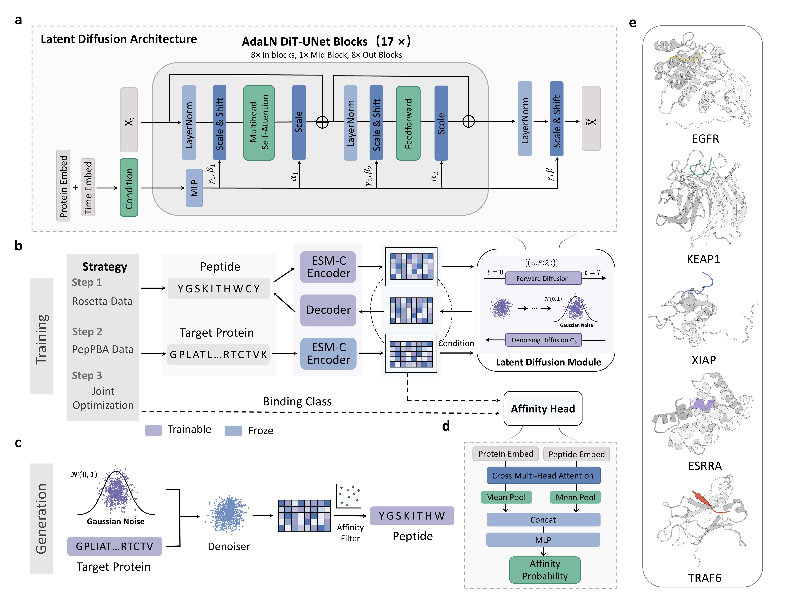

# High-PepBinder

This is the official implementation for the paper titled 'High-PepBinder: A pLM-Guided Latent Diffusion Framework for Affinity-Aware Target-Specific Peptide Design'.



## Setups

```bash
git clone git@github.com:mqyii/High-PepBinder.git
cd High-PepBinder
pip install .
```

## Peptide Binder De Novo Design

```bash
pepldm generate
```

## Datasets

- The XXX dataset can be downloaded at XXX
- Please place them at XXX

## Training

```bash
# pretrain the LDM on FRGDB
pepldm train frag
# finetuneing on the peptide real 
pepldm train pep
# trainning the affinity head on XX
pepldm train affinity
# train concistencly 
pepldm train2 
```
